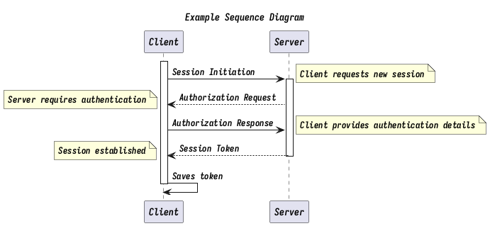

# basic syntax

## list

To buy:

1.  Milk
2.  Eggs
    - Organic
3.  Cheese
    - Parmesan
    - Mozarella

## inline sytle

``` org
*bold*
/italic/
_underline_
=verbatim=
~code~
+strike-through+
```

**bold** *italic* [underline]{.underline} `verbatim`{.verbatim} `code` ~~strike-through~~

# keybinds

- change depth `C-n S(shift)-tab`

# Agenda

- change todo status `C-c C-t`
- change priority `C-c ,`
- change deadline `C-c C-d`
- change scheduled `C-c C-s`
- change tags `C-c C-c`
- clock in `C-c C-x C-i`
- clock out `C-c C-x C-o`
- toggle inline image `C-c C-x C-v`

# Dired

- open dired `C-x d`
- change to wdired mode (to edit as plain txt) `C-x C-q`

# How to encrypt password

To use [[GNUPG]] to encrypt the password. Encrypt plain text contain password : gpg --recipient xiongchenyu6 --encrypt test Decrypt test.org to password without parenthes : echo yourPassword \| gpg --passphrase-fd 0 -q --for-your-eyes-only --no-tty -d \~/.password/test.gpg

# Mu4e index bug

``` shell
mu init --maildir=~/Maildir --my-address=xiongchenyu6@gmail.com
mu index
```

# Org

## Org-babel

### Plot in [[Python]]

exports can be [ code\| results\| both\| none] choose the one you need.

Example :

```python
# Comment to keep indentation
import pylab as pl
from numpy import sin, pi, linspace
t = linspace(0, 2*pi, 1000)
pl.plot(t, sin(t))
pic = 'Image/myfig.png'
pl.savefig(pic)
return pic
```

[file:]()

```plantuml
title Example Sequence Diagram
activate Client
Client -> Server: Session Initiation
note right: Client requests new session
activate Server
Client <-- Server: Authorization Request
note left: Server requires authentication
Client -> Server: Authorization Response
note right: Client provides authentication details
Server --> Client: Session Token
note left: Session established
deactivate Server
Client -> Client: Saves token
deactivate Client
```



```ditaa

|         |                  +------------------------+
|         |                  | cBLU                   |
|         |                  | food market            |
|         |                  +                        +
|         |                  |                        |
|         |                  |                        |
|         |                  +                        +
|         |                  |       +----+           |
|         |                  |       |gate|        {d}|
|         |                  +----+--+----+-----------+   每天回家路线
|  Road   |    +------------------------------------------------------------+
|         |    | +-------------------------------------------------------+  |  +------------------------+
|         |    | | cBLU                                                  |  |  | cBLU                   |
|         |    | | primary school                                        |  |  | Gov. Staff Residence   |
|         |    | |                              +--+ +--+ +--+ +--+      |  |  | +--+ +--+ +--+ +--+    |
|         |    | |                              |  | |  | |  | |  |      |  |  | |  | |  | |  | |  |    |
|         |    | |                              +--+ +--+ +--+ +--+      |  |  | +--+ +--+ +--+ +--+    |
|         |    | |                              +--+ +--+ +--+ +--+      |  |  | +--+ +--+ +--+ +--+    |
|         |    | |                              |  | |  | |  | |  |      |  |  | |  | |  | |  | |  |    |
|         |    | |                              +--+ +--+ +--+ +--+      |  |  | +--+ +--+ +--+ +--+    |
|         |    | |                              +--+ +--+ +--+ +--+      |  |  | +--+ +--+ +--+ +--+    |
|         |    | |                              |  | |  | |  | |  |      |  |  | |  | |  | |  | |  |    |
|         |    | |                              +--+ +--+ +--+ +--+      |  |  | +--+ +--+ +--+ +--+    |
|         |    | |                              +--+ +--+ +--+ +--+      |  |  | +--+ +--+ +--+ +--+    |
|         |    | |                              |  | |  | |  | |  |      |  |  | |  | |  | |  | |  |    |
|         |    | |                              +--+ +--+ +--+ +--+      |  |  | +--+ +--+ +--+ +--+    |
|         |    | |                              +--+ +--+ +--+ +--+      |  |  | +--+ +--+ /----\ +--+  |
|         |    | |                              |  | |  | |  | |  |      |  |  | |  | |  |>|cRED| |  |  |
|         |    | |                              +--+ +--+ +--+ +--+      |  |  | +--+ +--+|\----/ +--+  |
|         |    | |                              +--+ +--+ +--+ +--+      |  |  | +--+ +--+|+--+ +--+    |
|         |    | |                              |  | |  | |  | |  |      |  |  | |  | |  |||  | |  |    |
|         |    | |                              +--+ +--+ +--+ +--+      |  |  | +--+ +--+|+--+ +--+    |
|         |    | |                              +--+ +--+ +--+ +--+      |  |  | +--+ +--+|+--+ +--+    |
|         |    | |                              |  | |  | |  | |  |      |  |  | |  | |  |||  | |  |    |
|         |    | |                              +--+ +--+ +--+ +--+      |  |  | +--+ +--+|+--+ +--+    |
|         |    | +----+                                             +----+  |  +----+     |        +----+
|         |    +-|cPNK|                                             |cPNK|  +->|cPNK|-----+        |cPNK|
|         |      |gate|                                             |gate|     |gate|              |gate|
|         |      +----+                                             +----+     +----+              +----+
|         |      |                                                       |     | +--+ +--+ +--+ +--+    |
|         |      |                                                       |     | |  | |  | |  | |  |    |
|         |      |                                                       |     | +--+ +--+ +--+ +--+    |
|         |      |                                                       |     | +--+ +--+ +--+ +--+    |
|         |      |                                                       |     | |  | |  | |  | |  |    |
|         |      |                                                       |     | +--+ +--+ +--+ +--+    |
|         |      |                                                       |     | +--+ +--+ +--+ +--+    |
|         |      |                                                       |     | |  | |  | |  | |  |    |
|         |      |   /-----------------------------\                     |     | +--+ +--+ +--+ +--+    |
|         |      |   |                             |                     |     | +--+ +--+ +--+ +--+    |
|         |      |   |                             |                     |     | |  | |  | |  | |  |    |
|         |      |   |   c1AB                      |                     |     | +--+ +--+ +--+ +--+    |
|         |      |   |                             |                     |     | +--+ +--+ +--+ +--+    |
|         |      |   |  PlayGround                 |                     |     | |  | |  | |  | |  |    |
|         |      |   |                             |                     |     | +--+ +--+ +--+ +--+    |
|         |      |   |                             |   +----+            |     | +--+ +--+ +--+ +--+    |
|         |      |   |                             |   |cRED|            |     | |  | |  | |  | |  |    |
|         |      |   |                             |   |flag|            |     | +--+ +--+ +--+ +--+    |
|         |      |   |                             |   |    |            |     | +--+ +--+ +--+ +--+    |
|         |      |   |                             |   +----+            |     | |  | |  | |  | |  |    |
|         |      |   |                             |                     |     | +--+ +--+ +--+ +--+    |
|         |      |   |                             |                     |     | +--+ +--+ +--+ +--+    |
|         |      |   |                             |                     |     | |  | |  | |  | |  |    |
|         |      |   |                             |                     |     | +--+ +--+ +--+ +--+    |
|         |      |   |                             |                     |     | +--+ +--+ +--+ +--+    |
|         |      |   |                             |                     |     | |  | |  | |  | |  |    |
|         |      |   |                             |                     |     | +--+ +--+ +--+ +--+    |
|         |      |   \-----------------------------/                     |     | +--+ +--+ +--+ +--+    |
|         |      |                                                       |     | |  | |  | |  | |  |    |
|         |      |                                                       |     | +--+ +--+ +--+ +--+    |
|         |      |                                                       |     | +--+ +--+ +--+ +--+    |
|         |      |                                                       |     | |  | |  | |  | |  |    |
|         |      |                                                       |     | +--+ +--+ +--+ +--+    |
|         |      +----+--------------------------------------------------+     +----+-------------------+
```


### Skewer

Run [[JavaScript]] code beflow to connect to broswer

```javascript
javascript:(function(){var d=document;var s=d.createElement('script');s.src='http://localhost:8080/skewer';d.body.appendChild(s);})()
```

### Org-babel bug

remove all \*.elc files inside org folder

## Org cheat sheet

**bold** *italic* [underline]{.underline} `verbatim`{.verbatim} `code` ~~strike-through~~

## Org protocal

### Mac setup

1.  Create app

        on open location this_URL
            set EC to "/usr/local/bin/emacsclient --no-wait "
            set filePath to quoted form of this_URL
            do shell script EC & filePath
            tell application "Emacs" to activate
        end open location

2.  Add to last dict item

    ```plist
    <key>CFBundleURLTypes</key>
    <array>
    <dict>
        <key>CFBundleURLName</key>
        <string>org-protocol handler</string>
        <key>CFBundleURLSchemes</key>
        <array>
        <string>org-protocol</string>
        </array>
    </dict>
    </array>
    ```

3.  Register handler

    ```bash
    /System/Library/Frameworks/CoreServices.framework/Versions/A/Frameworks/LaunchServices.framework/Versions/A/Support/lsregister -R  -f /Applications/OrgProtocolClient.app
    ```

4.  Test

        open org-protocol://roam-ref\?template=r\&ref=test\&title=this

### Chrome setup

<javascript:location.href> = \'org-protocol://roam-ref?template=r&ref=\'

- encodeURIComponent(location.href)
- \'&title=\'
- encodeURIComponent(document.title)
- \'&body=\'
- encodeURIComponent(window.getSelection())

# Emacs Plugins

- Ace **gs**

# Complete file path

*C-x C-f*

好的