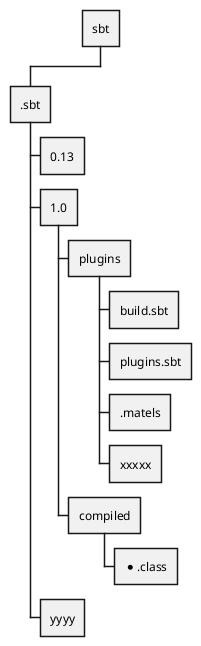
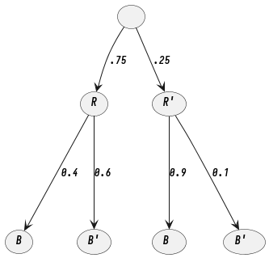

# Git

## Reset gitignore cache

``` shell
git rm -r --cached .
git add .
git commit -m "fixed untracked files"
```

## Remove git submodule

``` shell
git submodule deinit <path_to_submodule>
git rm <path_to_submodule>
git commit-m "Removed submodule "
rm -rf .git/modules/<path_to_submodule>
```

## revert commits

git revert --no-commit 0d1d7fc3..HEAD

## Clone with submodule recursive

``` shell
git clone --recurse-submodules -j8 git://github.com/foo/bar.git
```

## git ignore

如何用 gitignore 保留文件树特定的叶子，而忽视其他节点 我碰到了这样一个问题，我想保留一个 sbt 项目中 sbt/.sbt/1.0/plugins/下所有以 sbt 结尾的文件而忽视其他所有文件





我本来简单的以为过滤掉根目录然后反选对应的文件，如下

``` gitignore
sbt/.sbt/*
!sbt/.sbt/1.0/plugins/*.sbt
```

结果不行，所有的文件包括我想要的 sbt/.sbt/1.0/plugins/\*.sbt 都会被过滤掉,经过文档阅读,原来第一条规则 `.sbt/*` 会过滤掉子目录里面所有的文件，导致 `sbt/.sbt/1.0/plugins/*.sbt` 根本不存在，也就无法反选 1.0 下的内容,而反选只能对过滤掉的内容生效，实际上过滤掉的是 `sbt/.sbt/1.0` 那么手动去一级一级递归选择+反选，就可以满足

``` gitignore
sbt/.sbt/*
# 过滤掉.sbt下的文件包括1.0
!sbt/.sbt/1.0
# 反选1.0
sbt/.sbt/1.0/*
# 过滤掉1.0下的文件包括plugins
!sbt/.sbt/1.0/plugins
# 反选plugins
sbt/.sbt/1.0/plugins/*
# 过滤掉plugins下的文件包括 *.sbt
!sbt/.sbt/1.0/plugins/*.sbt
# 反选 *.sbt
```

以上，经过测试完美满足过滤所有文件仅保留 `sbt/.sbt/1.0/plugins/*.sbt` 下内容

不过 gitignore 提供了递归过滤， `**` 可以递归出每一级目录，我们只需单独反选出对应的目录，逻辑聚合就就可以达到我们想要的结果，如下

``` gitignore
sbt/.sbt/**
!sbt/.sbt/1.0
!sbt/.sbt/1.0/plugins
!sbt/.sbt/1.0/plugins/*.sbt
```
