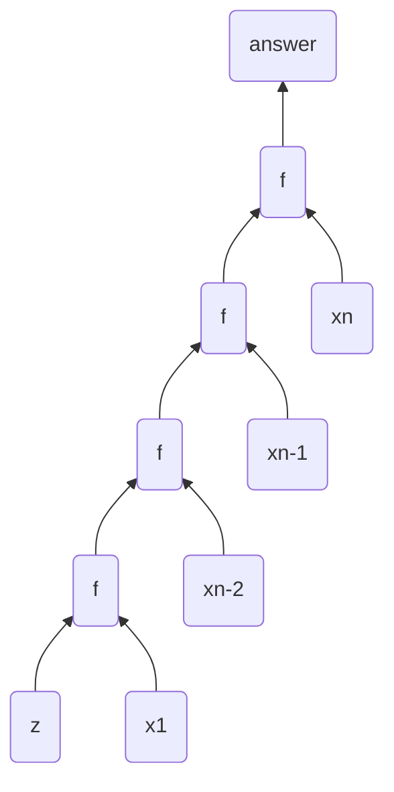
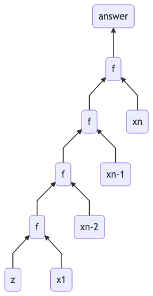
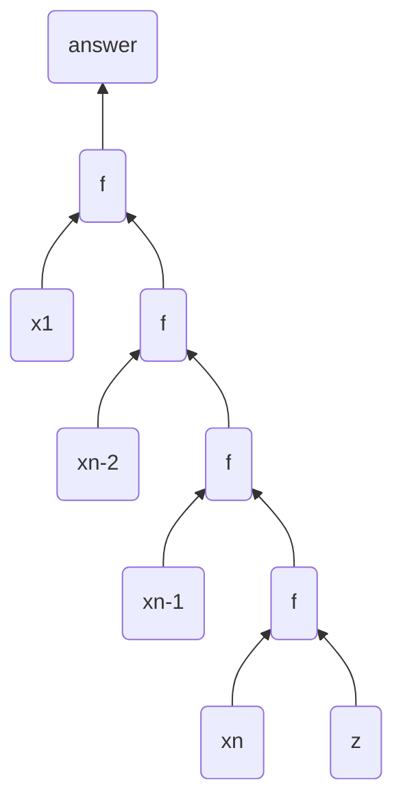
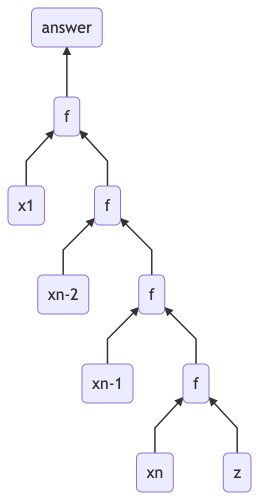

# Types

## Number System

### Integral (type class)

- Int (32 bits)
- Inteter (abitrarily)

### Fractional (type class)

- Float
- Double
- Scientific
- Rractional

### polymorphism

1. parametric polymorphism

    - Typeclass constrained
    - constrained polymorphism (ad-hoc, polymorphism)

# Typeclass

Typeclass define a set of functions that can have different implementations depending on the type of data they are given.

# Kinds

Types of type constructors.Kinds are not types until they are fully applied.

# Infix type

When we give an operator a non-alphanumeric name, it is infix by default.

# Monad

## chain

a >> f = a >>= \\\_ -> f

# Monoid

A monoid is a binary associative operation with an identity.

# State Monad

>> doesn\'t throw away everything from the first argument.


    a >> b = \s -> let (x, s') = a s in b s'

# Semigroup

``` haskell
data NonEmpty a = a :| [a] deriving (Eq, Ord, Show)
```

:| infix data constructor alphanumeric names are prefix symbol names are infix

# data keyword diff from new-type

new-type can have only one value constructor, which must have exactly one field

# Reader monad

``` haskell
(.) ::               (b->c)->(a->b)->(a->c)
fmap :: Functor f => (a -> b) -> f a -> f b
```

# IO

every I/O action must return some IO type Fa 本体是 a，如果是函数，本体拿出来就是那个参数

# Build & Install

```bash
ghc --dynamic xxx.hs
```

static link

```bash
cabal configure --with-compiler=/usr/share/ghc-pristine/bin/ghc
```

# data keyword diff from newtype #NOTE

newtype can have only one value constructor, which must have exactly one field

# chain #NOTE

a >> f = a >>= \\\_ -> f

# Fold

- foldl

`foldl f z xs`

Terms:

$xs = x_1 : xs_1$

$xs = x_1 : x_2 : xs_2$

$xs_n = (x_n : [])$





- foldr

`foldr f z xs`





So how to represent **foldl** use **foldr**. From the graph above we can observe that **foldr** is right associative as the *list* data structure. While **foldl** is left associative, and it is an eager computation. So we need a "trampoline" / function stack to hold the computation, and reverse the control.

Let us define g as `g = flip . foldl f`

``` haskell
foldl f v xs = g xs v
    where
        g []     = \v -> v
        g (x1:xs) = \v -> g xs (f v x1)
```

``` haskell
foldr h z xs = g xs v
  where
    i [] = z
    i (x1:xs) = h x1 (g xs)
```

While let us define i as `i = foldr h z`

since the left hands equals and value calculated from foldr equals to foldl from the first equation. We can have $z = \lambda v \to v$ so $z=id$

from the second one:

$h x_1 (g xs) = \lambda v \to g xs (f v x_1)$

$h x_1 g' = \lambda v \to g' (f v x_1)$

$h = \lambda x_1 g' \to \lambda v \to g'(f v x_1)$

Since h is step function of foldr, $x_1$ is elem pop from the list, g\' is the accumulator of rest of function, v is the initial value, we can rewrite the code below.

``` haskell
foldl stepL zeroL xs = (foldr stepR id xs) zeroL
  where stepR lastL accR accInitL = accR (stepL accInitL lastL)
```

[@swanStochasticSynthesisRecursive2019]

# Reader monad

``` haskell
newtype Reader r a = Reader {
  runReader :: r -> a
}

instance Monad (Reader r ) where
  return a = Reader $ \_ -> a
  m >>= k = Reader $ \r -> runReader (k (runReader m r )) r
```

# SKI combinator

``` haskell
k :: a -> b -> a
k x y = x

s :: (a -> b -> c) -> (a -> b) -> a -> c
s x y z = (x z) (y z)

i :: a -> a
i x = x
```

# reader monad and ski combinator relationship

``` haskell
return :: a -> r -> a
(>>=) :: (r -> a) -> (a -> r -> b) -> r -> b

pure :: a -> r -> a
(<*>) :: (r -> a -> b) -> (r -> a) -> r -> b
```
