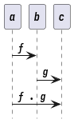
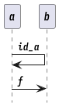
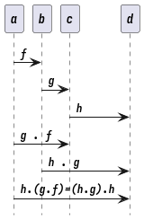

# Algorithm Theory

## 算法导论

### Optimal binary tree

In the range(i,j), if pick i as the root, then the left subtree will become (i,i-1) so have the dummy leaf di-1, so if pick j as the root, the right subtree become (j,j+1) have the dummy leaf dj.

# Category theory

A category consists of objects and arrows that go between them.

``` haskell
-- A function can never be called
absurd :: Void -> a

```

## Basic

Primitive : No property Abstraction `Composition`

```plantuml
hidefootbox
a -> b : f
b -> c : g
a -> c : f . g

```



`Identity` f . id<sub>a</sub> = f id<sub>a</sub> . f = f

```plantuml
hidefootbox
a -> a : id_a
a -> b : f
```



`Associativity` h . (g . f) = (h . g) . f

```plantuml
hidefootbox
a -> b : f
b -> c : g
c -> d : h
a -> c : g . f
b -> d : h . g
a -> d : h.(g.f)=(h.g).h
```



`Function` : A mapping of values to values

## Set

Type are sets. In Set, objects are sets and morphisms (arrows) are functions. A set of morphisms between two objects in any category is called a hom-set.

## \_|~(Buttom)~

Unicode ⊥. This "value" corresponds to a non-terminating computation.

``` haskell
f :: Bool -> Bool
```

Functions that may return bottom are called partial, as opposed to total functions, which return valid results for every possible argument.

## Order

preorder partial order A set of morphisms from object a to object b in a category C is called a hom-set and is written as C(a, b) (or, sometimes, HomC(a, b)). So every hom-set in a preorder is either empty or a singleton.

## Monoid

mappend maps an element of a monoid set to a function acting on that set A monoid is a single object category.

## Category

[2017-05-09 Tue 23:17] `Kleisli category` a category based on a monad. any category C we can define the opposite category Cop just by reversing all the arrows. terminal object is the initial object in the opposite category.

## Product

A product of two objects a and b is the object c equipped with two projections such that for any other object c' equipped with two projections there is a unique morphism m from c' to c that factorizes those projections.

## Asymmetry

surjective + injective = bijection (isomorphism)

## Kleisli category

## Bifunctors

C x D = E

## Covariant and Contravariant Functors

``` haskell
class Contravariant f where
contramap :: (b -> a) -> (f a -> f b)

```

## Profunctors

C \^ op x D = E

## Initial Object

The initial object is the object that has one and only one morphism going to any object in the category.

## Yoneda lemma

CPS higher order function to data type [C,Set] (C(a,-),F) =~ Fa

## Represetable

c(L1,-) = Rc Data type as the key to get value

# Lambda Mathematics

## Definitions

Zero: λs.(λz.z) 1 ≡ λsz.s(z) 2 ≡ λsz.s(s(z)) 3 ≡ λsz.s(s(s(z))) S ≡ λwyx.y(wyx)

**Multiplication** (λxyz.x(yz))

**Conditionals** T ≡ λxy.x F ≡ λxy.y ∧ ≡ λxy.xy(λuv.v) ≡ λxy.xyF ∨ ≡ λxy.x(λuv.u)y ≡ λxy.xTy ¬ ≡ λx.x(λuv.v)(λab.a) ≡ λx.xFT

**conditional test** Z ≡ λx.xF¬F (zero predicate)

# Linear algebra

## Linear transformation

Associative Use new base to represent the old A . B = C use column of A vector to represent the basis in B
