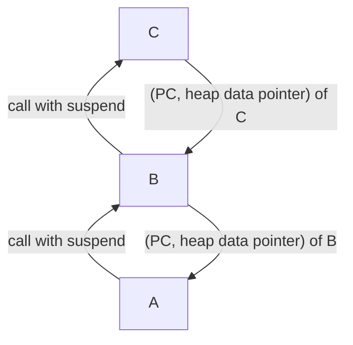
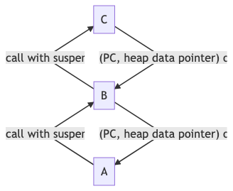
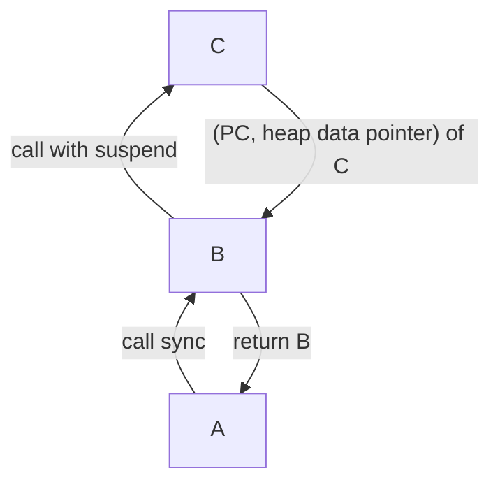
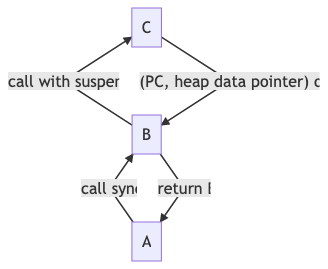
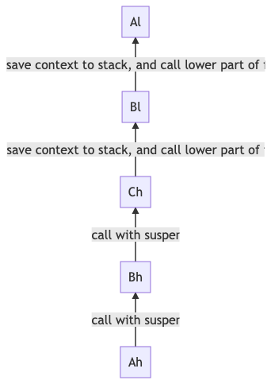

# Linux

Year 2009

  ------------------------------------- ------------- -----------
  L1 cache reference                    0.5 ns        
  Branch mispredict                     5 ns          
  L2 cache reference                    7 ns          
  Mutex lock/unlock                     100 ns        
  Main memory reference                 100 ns        
  Compress 1K bytes with Zippy          10,000 ns     
  Send 1K bytes over 1 Gbps network     10,000 ns     0.01 ms
  Read 1 MB sequentially from memory    250,000 ns    0.25 ms
  Round trip within same datacenter     500,000 ns    0.5 ms
  Disk seek                             10,000,000    ns 10 ms
  Read 1 MB sequentially from network   10,000,000    ns 10 ms
  Read 1 MB sequentially from disk      30,000,000    ns 30 ms
  Send packet CA->Netherlands->CA     150,000,000   ns 150 ms
  ------------------------------------- ------------- -----------

Year 2020

  -------------------------------------- -------------- ----------
  L1 cache reference                     1 ns           
  L2 cache reference                     4 ns           
  Branch mispredict                      3 ns           
  Mutex lock/unlock                      17 ns          
  Main memory reference                  100 ns         
  Compress 1K bytes with Zippy           2000 ns        
  Send 2K bytes over commodity network   44 ns          
  Read 1 MB sequentially from memory     3000 ns        
  Round trip within same datacenter      500,000 ns     
  Disk seek                              2,000,000 ns   2 ms
  Read 1 MB sequentially from disk       825,000 ns     0.825 ms
  Read 1 MB sequentially from SSD        49000 ns       
  -------------------------------------- -------------- ----------

## Arch Linux

### Install Arch Linux

1. Partition

    cgdisk /dev/sda mkfs.ext4 mkswap swap on

2. install system

    ``` shell
    mount xxxx
    pacstrap /mnt base base-devel
    ```


3. create user with groups

    ``` shell
    useradd -m -G tty -s chenyu
    mem log network video audio kmem wheel adm
    ```

4. boot loader

    mount base partition (ext4) to /mnt & mount esp partition (fat32) to /mnt/boot

    ``` shell
    arch-chroot /mnt
    sudo pacman -S git grub dosfstools os-prober efibootmgr
    grub-install --target=x86_64-efi --efi-directory=/boot --bootloader-id=grub --recheck
    grub-mkconfig -o /boot/grub/grub.cfg
    ```


5. drivers

    ``` shell
    xorg-drivers
    ```

6. Debug xinit

    ``` shell
    startx > startx.log
    ```

7. Stop beep

    ``` shell
    xset b 0 0 0
    ```


8. font install

    Install Consolas-with-yahei for terminal

9. Install audio

    install pavucontrol avaci pulseaudio packages

10. Sync clipboard

    clipit

11. Pkg-config not find python 3

    ``` shell
    sudo ln -s /usr/lib/pkgconfig/python3.pc /usr/lib/pkgconfig/python.pc
    ```

12. net work

    dhcpcd

13. Migration

    ``` shell
    pacman -Qqe > pkglist.txt
    ```

14. Add key

    ``` shell
    gpg --keyserver pool.sks-keyservers.net --recv-keys 931FF8E79F0876134EDDBDCCA87FF9DF48BF1C90
    ```

15. Language

    - Dbus
    - Fcitx

### Package Management

1. [2020-10-24 Sat]

    Recursive Delete package

    ```bash
    sudo pacman -Rcs xxx
    ```

    [复盘](~/Dropbox/Org/refile.org::*复盘)

## Ubuntu

## openssl

how to show company mail cert

``` shell
openssl s_client -connect mail.google.sg:995 -showcerts
```

## k8s

### install

kubeadm

```bash
sudo kubeadm init --pod-network-cidr=192.168.0.0/16 --ignore-preflight-errors=all
kubectl taint nodes --all node-role.kubernetes.io/master-
```

### network

- Calico

  ```bash
  kubectl create -f https://docs.projectcalico.org/manifests/tigera-operator.yaml
  kubectl create -f https://docs.projectcalico.org/manifests/custom-resources.yaml
  watch kubectl get pods -n calico-system

  ```

- Ingress

### API server boot

``` shell
brew tap kubernetes-incubator/apiserver-builder https://github.com/kubernetes-incubator/apiserver-builder.git
brew install kubernetes-incubator/apiserver-builder/apiserver-boot
```

## etcd

``` shell
alias ectl='ETCDCTL_API=3 etcdctl --endpoints=https://127.0.0.1:2379 --cacert=/run/config/pki/etcd/ca.crt --key=/run/config/pki/etcd/peer.key --cert=/run/config/pki/etcd/peer.crt'
```

# Wine

```bash
winetricks riched19
winetricks riched30
env WINEARCH=win64 $WINE_CMD "c:\\Program Files (x86)\\WXWork\\WXWork.exe" &
```

# Docker

```bash
docker exec -i -t dazzling_lichterman /bin/bash
docker run -t -d cef462a9ceb5
docker stop $(docker ps -a -q)
docker rm $(docker ps -a -q)
```

http repo insecure

# K8s

## Ingress

controller should have

``` yaml
hostnetwork = true
```

# Netwok

## Route

### IGP(interior routing protocal)

- EIGRP
- IS-IS
- RIP
- OSPF

### EGP(exterior routing protocal)

- BGP

### P2p

- Torrent
- Bit tracker

### Virtual Switch by linux namespace

### Private Ip

10/8 172.16/12 192.168/16

### Find DDos

``` shell
ss | awk '{print $6}' | cut -d: -f1 | sort | uniq -c | sort -n
```

# Multi-Thread

## Process

### New

### Ready

### Run

### Blocked or Wait

### Terminate or Complete

### Suspend ready

### Suspend Wait

## Thread

## Scheduler

### Cooperative

### Preemptive

### Type

- **Long term** -- performance -- Makes decision about how many processes should be made

to stay in the ready state this decides the degree of multiprogramming. Once decision is taken it lasts for long time hence called long term scheduler.

Long Term or job scheduler It brings the new process to the 'Ready State'. It controls Degree of Multi-programming, i.e., number of process present in ready state at any point of time.It is important that the long-term scheduler make a careful selection of both IO and CPU bound process.

- **Short term** -- Context switching time -- Short term scheduler will decide which

process to be executed next and then it will call dispatcher. Dispatcher is a software that moves process from ready to run and vice versa. In other words, it is context switching.

Short term or CPU scheduler: It is responsible for selecting one process from ready state for scheduling it on the running state. Note: Short-term scheduler only selects the process to schedule it doesn't load the process on running. Dispatcher is responsible for loading the process selected by Short-term scheduler on the CPU (Ready to Running State) Context switching is done by dispatcher only. A dispatcher does the following:

- Switching context.

- Switching to user mode.

- Jumping to the proper location in the newly loaded program.

- **Medium term** -- Swapping time -- Suspension decision is taken by medium term

scheduler. Medium term scheduler is used for swapping that is moving the process from main memory to secondary and vice versa.

Medium-term scheduler It is responsible for suspending and resuming the process. It mainly does swapping (moving processes from main memory to disk and vice versa). Swapping may be necessary to improve the process mix or because a change in memory requirements has overcommitted available memory, requiring memory to be freed up.

### context switching

1. process

    register tlb virtual memeory kernal resource

2. thread

    all register

3. goroutine

    - cooperative scheduling only happen in io wait / channel wait, increate goroutine only affect too much performance, kernal thread will need to reschedule every 10 ms
    - no interrupt only need to store PC SP DX, (thread will also need to store AVX MMX FP)
    - only 2k stack size

## Coroutine

Only 2 ways to leave a function

1. return and destroy the stack
2. create a function call to a new function

A stackful coroutine has all of the machinery of a thread without being scheduled on the OS. A stackless coroutine is an augmented function object that has goto labels in it that let it be resumed part way through its body.

### Stackless

``` scala
def A () {
    val b = async (B())
    .
    .
    .
    .
    return await b
}
def B () {
    val c = Future(C())
    .
    .
    .
    .
    return await c
}
def C () {
    system.sleep(200)
    return "c"
}
```





With a stackless coroutine, only the top-level routine may be suspended. If we have routine nested inside, we will never have ability to jump to the deepest level of the coroutine, so this kind of code won\'t exec properly.

```javascript
async A () {
    b = B()
    .
    .
    .
    return b // something wrong, c is still not finished and we could not restore back to c
}
B () { // B is not a coroutine which means return value of b will not contains the pc & heap data only return value
    c = C()
    .
    .
    .
    return c
}
async C () {
    await sleep(200)
    return

```





### Stackful

1. Fiber

    the whole stack is saved to suspend the routine, allowing us to suspend at any point in execution anywhere.

    In contrast to stackless coroutines, languages with stackful coroutines let you suspend your coroutines at any point.

    In stackful coroutine we have stack A, stack B, stack C, so we can simply save the register switches stack and instruction pointer in assembly code, since stack will hold all input params and local variable, it will behave same as fucntion.

    ```javascript
    async A () {
        b = B()
        .
        .
        .
        return b
    }
    async B () {
        c = C()
        .
        .
        .
        return await c
    }
    async C () {
        await sleep(200)
        return

    ```

    ```mermaid
    graph BT
    Ah -->|"call with suspend"| Bh
    Bh -->|"call with suspend"| Ch
    Ch -->|"save context to stack, and call lower part of func B"| Bl
    Bl -->|"save context to stack, and call lower part of func A"| Al
    ```

    

    ```javascript
    async A () {
        b = B()
        .
        .
        .
        return b
    }
    B () {
        c = C()
        .
        .
        .
        return await c
    }
    async C () {
        await sleep(200)
        return

    ```

    ```mermaid
    graph BT
    Ah -->|"call with suspend"| Bh
    Bh -->|"call with sync, then jump to function c"| Ch
    Ch -->|"save context to stack, and call lower part of func B"| Bl
    Bl -->|"save context to stack, and call lower part of func A"| Al
    ```

    We can find that the stackful conrouine will use only function call and function return of the default CPU behaviour, which won\'t back propagation the async/wait or future/promise syntax.

### Schedule

Stateless coroutine is cooperative while stackful is preemptive

### Symmetric

- Symmetric coroutines have only one function that suspends the current context and resumes another one.
- callcc()/continuation

1. difference between continuation and callback

    - continuation invoking a continuation causes execution to resume at the point the continuation was created. In other words: a continuation never returns.
    - callback is that after a callback is invoked (and has finished) execution resumes at the point it was invoked

### Asymmetric

- a suspend-function that is called from within the coroutine
- a resume-function that is called by the caller

## ProtoThreads

## Event Handles

## Event dispatcher

## Memory barrier

- relaxed ordering 不参与 synchronized-with 关系,唯一的要求是在同一线程中，对同一原子变量的访问不可以被重排, 一般 fetch<sub>add</sub> 用来做计数器
  - memory<sub>orderrelaxed</sub>
- `full_mb`
  - memory<sub>orderseqcst</sub>
- `write_mb` wait other invalid queue to ack and save to store buffer
  - memory<sub>orderrelease</sub> (memory<sub>orderacqrel</sub> 同时 acquire and release 一般用于 read<sub>modifywrite</sub> 操作)
- `read_mb` process invalid queue before read
  - memory<sub>orderacquire</sub>,
- `dd_mb` data dependency memory barrier 第二个 load 操作依赖第一个 load 操作的执行结果（例如：先 load 地址，然后 load 该地址的内容）
  - memory<sub>orderconsume</sub>
