# CPU

- write back
- write through

# Cache aside

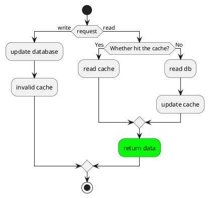

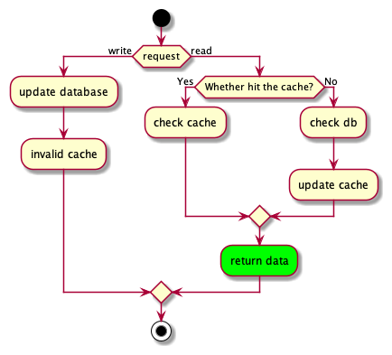

## 缓存不一致补偿

### 业务代码重试

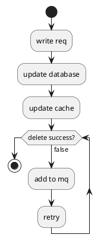

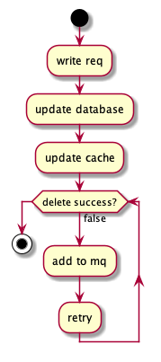

### 数据库 binlog 消费

### Data Transmission Service

云服务商的同步

# Read through

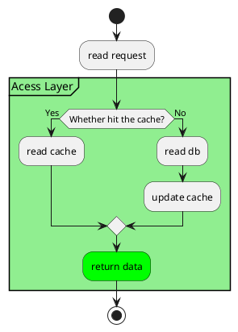

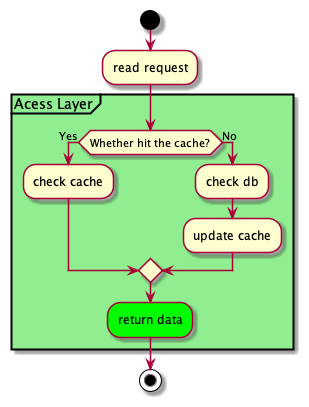

# Write through

适合写操作较多，并且对一致性要求较高的场景

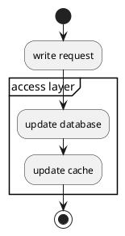

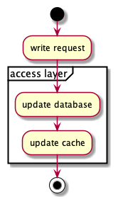

# Write behind

电商秒杀

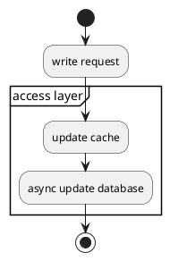

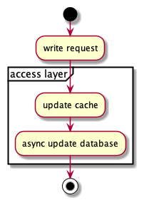

# Write around

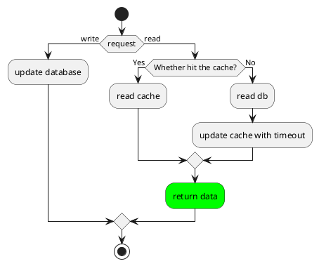

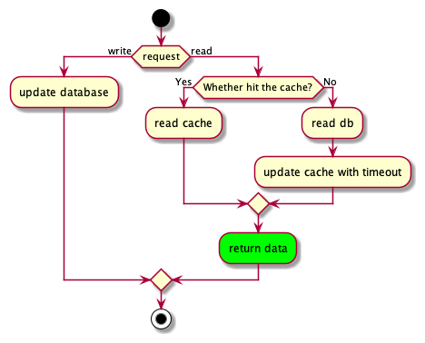

# conclusion

In scenarios with more reads and less writes, you can choose to use the "Cache-Aside combined with consumer database logs for compensation" solution. For scenarios with more writes, you can choose to use the "Write-Through combined with distributed locks" solution, which is extreme for more writes. In the scene, you can choose to adopt the "Write-Behind" scheme.
