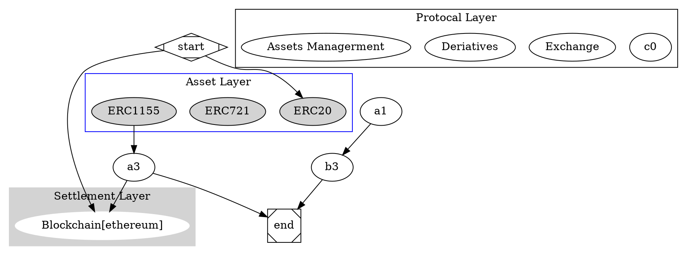
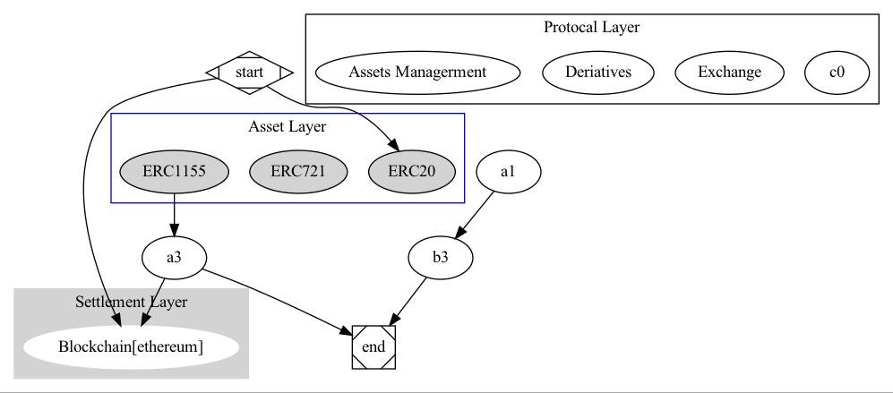

# Defi Stand for decentralized finance.

```dot
digraph G {
        subgraph cluster {
                node [style=filled,color=white];
                style=filled;
                color=lightgrey;
                a0[label="Blockchain[ethereum]"];
                label = "Settlement Layer";
        }
        subgraph cluster1 {
                node [style=filled];
                b0[label="ERC20"]
                b1[label="ERC721"]
                b2[label="ERC1155"]
                label = "Asset Layer";
                color=blue
        }
        subgraph cluster2 {
                label = "Protocal Layer";
                c0[lable="Lending"]
                c1[label="Exchange"]
                c2[label="Deriatives"]
                c3[label="Assets Managerment"]
        }

        start -> a0;
        start -> b0;
        a1 -> b3;
        b2 -> a3;
        a3 -> a0;
        a3 -> end;
        b3 -> end;
        start [shape=Mdiamond];
        end [shape=Msquare];
}

```

