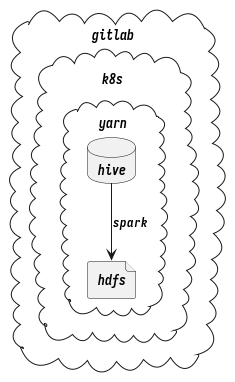

# Build recall models by gitlab-scheduler

Below shows the current situation which have 2 main disadvantages

```plantuml
start
partition Crontab/Airflow {
    :get raw data from spark;
    :write kv data on disk on a txt file;
    if(int2int) then (yes)
       :build index;
    elseif(int2float) then (yes)
       :build index;
    elseif(string2string) then (yes)
       :build index;
    endif
    :publish to k8s platform;
}
end
```


## Crontab

- It is highly coupling with the host machine and it will cause problem if the build machine is gone
- Concurrently build multiple models on the same machine will cause lag
- script is bug prone, no one will notice the change of the script

## Airflow

- Airflow still remain the problem that no one will notice the change of the script.

## Gitlab

1. The script save as code and it will send notification to anyone who subscribe to the project when changes being make. So other people can monitor and review the code.
2. Gitlab can periodically run the code
3. Gitlab runner can target on k8s so it also don\'t have single point of failure problem

Now the question remain on how to leverage Gitlab to do the whole process:

### Gitlab Branch Layout

```plantuml

participant "Master" as M
participant "Develop" as D

== Initialization ==

M -> D: Fork a project and create a develop branch

== Testing ==

D -> D: Write and test model
D -> M: Merge final script to master branch

== Running ==
M -> M: gitlab scheduler will call run script in master periodically or submit script to airflow

```


```plantuml

cloud gitlab {
cloud k8s {
cloud yarn {
    file hdfs
    database hive
    hive --> hdfs : spark
}
}
}

```


