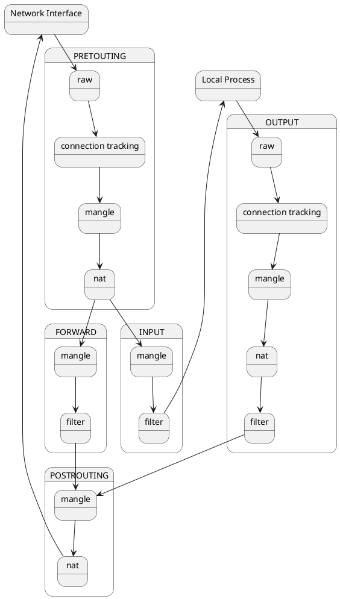
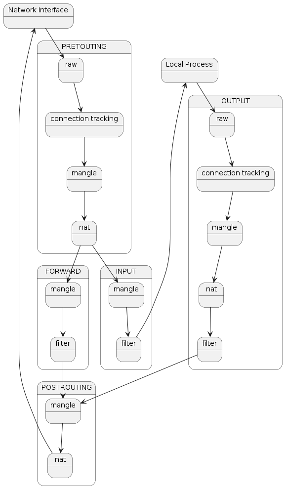

# how to view all

```bash
_ iptables --table filter -L -n -v --line-numbers
```

# how to delete one rule

```bash
iptables -D INPUT 1
```

# how the different chains works


```plantuml
@startuml


state "Network Interface" as ni 
state "Local Process" as lp

state "PRETOUTING" as pr {
  state "raw" as r
  state "connection tracking" as ct
  state "mangle" as m
  state "nat" as n
  r --> ct
  ct --> m
  m --> n
} 

state "INPUT" as i {
  state "mangle" as mi
  state "filter" as if
  n --> mi
  mi --> if
  if --> lp
}

state "FORWARD" as fd {
  state "mangle" as mf
  state "filter" as ff
  mf --> ff
  n --> mf
}

state "OUTPUT" as o {
  state "raw" as or
  state "connection tracking" as oct
  state "mangle" as om
  state "nat" as on
  state "filter" as oif
  lp --> or
or --> oct
oct --> om
om --> on
on --> oif

}

state "POSTROUTING" as p {
  state "mangle" as pm
  state "nat" as pn

  oif --> pm
  ff --> pm
  pm --> pn
  pn --> ni
}

ni --> r 

@enduml
```


